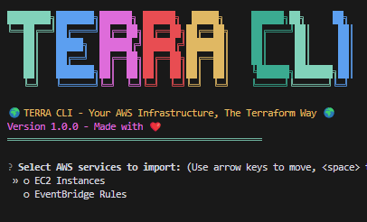

# terra-cli
A CLI written in Python that imports AWS resources.

## Requirements
- Python 3.10+
- AWS CLI configured
- Terraform 1.9.8 (tested on 1.9.8, may work on other versions)

## Installation

1. Clone this repository
```
git clone https://github.com/yourusername/terra-cli.git
cd terra-cli
```
2. `pip install -e .`

3. `terra scan`



4. Choose either EC2 or Event Bridge Rules. Press Enter.

5. Terraform files will be created in a `terraform` directory in the current working directory.
